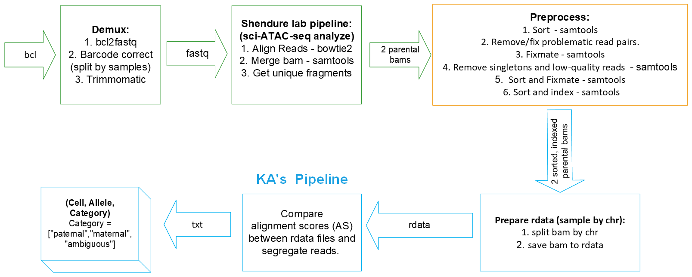

# 2021_kga0_4dn-mouse-cross

### KA Allele Segregation Pipeline

This pipeline is used to segregate sci-ATAC-seq alignments to parental alleles of origin based on alignment scores.

## News and Updates

* 2022-04-13
  + upload/update test code for debugging the preprocess module
  + update README for information on running the test code

* 2022-04-08
  + replace the workflow chart.
  + upload code to debug preprocess module
  
* 2022-03-27
  + for `04`, add additional code to remove singletons from split bam files

* 2022-03-26
  + add additional options, corrections to `04-split-index-repair-bam.sh`
    * "mm10" mode, which does not output POS and MPOS bed files
    * "strain" mode, which outputs POS and MPOS bed files
    * additional to sort and index bam infile if necessary
  + update associated test script for new modes

* 2022-03-24
  + update workflow chart with yellow box (preprocess step)
  + update run script for preprocess step

* 2022-03-23
  + add `06-convert-bam-to-df_join-bed_write-rds.R`
  + clean up repo, removing unneeded scripts and data files
  + update dependencies listed in `README`

* 2022-03-20
  + add 05-lift-strain-to-mm10.sh
  + add script to download and process liftOver chain files: `get-liftOver-chains.sh`
  + add script to downsample bam files: `generate-downsampled-bam.sh`
  + minor changes to workflow scripts `01` and `04`
  + update `README`, including sample-call section

* 2022-03-19
  + update workflow image
  + update `README` for (filter reads with MAPQ < 30; then removing singleton; subread repair)
  + update code for (filter reads with MAPQ < 30; then removing singleton; subread repair.)

* 2022-03-17
  + add new workflow image.
  + CX updated get_unique_fragments.py. Kris will test it on duplicates.
  + After Shendure lab pipeline, we will first filter reads with MAPQ < 30; then removing singleton; (Kris: no need to sort anymore) subread repair. 

## Installation

`#TODO` Need to add later.
`#TODO` Need to include additional dependencies.
  + [argparser](https://bitbucket.org/djhshih/argparser) = 0.7.1
  + [bedtools](https://bedtools.readthedocs.io/en/latest/) >= 2.29.0
  + [liftOver](http://hgdownload.soe.ucsc.edu/downloads.html#source_downloads) >= 366
  + [parallel](https://www.gnu.org/software/parallel/) >= 20200101
  + [Picard](https://broadinstitute.github.io/picard/) >= 2.26.4
  + [R](https://www.r-project.org/) >= 4.0
  + [Rsamtools](https://bioconductor.org/packages/release/bioc/html/Rsamtools.html) = 2.8.0
  + [samtools](http://www.htslib.org/) >= 1.13
  + [subread](http://subread.sourceforge.net/) = 2.0.1
  + [Tidyverse](https://www.tidyverse.org/) = 1.3.1

## Workflow



The user needs to run the following steps to prepare the input for KA's pipeline:
1. Demux. ([Example Code 1](https://github.com/Noble-Lab/2021_kga0_4dn-mouse-cross/blob/main/bin/workflow/01-demux.sh))
2. sci-ATAC-seq analysis pipeline from the Shendure Lab. ([Example Code 2](https://github.com/Noble-Lab/2021_kga0_4dn-mouse-cross/blob/main/bin/workflow/02-sci-ATAC-seq-analysis.sh))
3. Preprocess the bam. ([Example Code 3](https://github.com/Noble-Lab/2021_kga0_4dn-mouse-cross/blob/main/bin/workflow/03-preprocess-mm10.sh))
   + filter reads with MAPQ < 30 and remove singletons,
   + perform subread repair to pair mates.

```{bash preprocess-bam}
## use mm10 as an example

## create output directory
# mkdir mm10-output/MAPQ30_RmSingleton
# mkdir mm10-output/Repair

for i in {1..22} ## run 22 samples in parallel
do
    echo "Running: "
    echo $i
    Job_name="mm10"_$i
    ./preprocess.sh $i
    # qsub -l mfree=10G -N $Job_name 03-preprocess-mm10.sh $i
    echo "Done!"
done

```

test code for proprocessing
```{bash preprocess-bam-updated}
#  Log into cluster node with 6 cores, 12GB memory total available
qlogin -l mfree=2G -p serial 6

#  Activate conda environment or load UGE modules for samtools and picard, for
#+ example...
module load picard/2.26.4
module load samtools/1.9

#  Because there will be a lot of reading from/writing to disk, perform work
#+ in a "${TMPDIR}"
cd "${TMPDIR}" || ! echo "cd into \"\${TMPDIR}\" failed. Did you run qlogin to get into a node?"

#  Copy bam infile into "${TMPDIR}"; for example...
cp "/net/noble/vol1/home/gangliuw/proj/2022-01-mouse-cross/results/2022-02-23/get_unique_fragments/Disteche_sample_6.dedup.bam" .

#  Copy test script into "${TMPDIR}"; for example...
# cp /path/to/2021_kga0_4dn-mouse-cross/bin/test-preprocessing-gangliuw_2022-0411.sh .

#  Run the test script; infile will be read from and outfiles will be written
#+ to "${TMPDIR}"
bash ./test-preprocessing-gangliuw_2022-0411.sh \
-u FALSE \
-i ./Disteche_sample_6.dedup.CAST.bam \
-o . \
-p 6

#  When the script is finished (will ~2 hours), copy infile/outfiles to non-TMPDIR
#+ directory (files on "${TMPDIR}" will be removed when you log off the node);
#+ for example...
cp *.{bam,txt,gz} /path/to/2021_kga0_4dn-mouse-cross/bin/results/kga0/2022-0413_test-preprocessing-gangliuw


#  Help information for test-preprocessing-gangliuw_2022-0411.sh
test-preprocessing-gangliuw_2022-0411.sh -h

# test-preprocessing-gangliuw_2022-0411.sh:
# Run bam file through the steps of the test 2021_kga0_4dn-mouse-cross
# preprocessing module as of 2022-0411-0413.
# 
# Preprocessing is made up of the following steps:
#     1. QNAME-sort bam file output by the Shendure-Lab pipeline (this
#        is not necessary but speeds up the following step
#        considerably)
#     2. Identify QNAMEs with >2 entries in the bam file (this step is
#        slow; there's likely room for optimization)
#     3. Create a bam file comprised of only duplicated QNAME entries
#        (this step is optional; it's not strictly necessary)
#     4. Filter bam file to exclude QNAMEs with >2 entries by
#        (a) coordinate-sorting the QNAME-sorted bam file and
#        (b) filtering the coordinate-sorted bam file with picard
#            FilterSamReads (picard FilterSamReads takes only
#            coordinate-sorted bam files as input; also, picard
#            FilterSamReads is exponentially faster than filtering
#            with grep)
#     5. QNAME-sort the filtered bam file; then, to update flag
#        information in the bam file, perform samtools fixmate on the
#        bam file
#     6. Prior to filtering out reads based on pairing status and MAPQ
#        values, sort by coordinate again
#     7. Filter out reads based on pairing status and MAPQ: Run
#        samtools view with flags -f 3 -F 12 -q 30
#     8. Sort bam by QNAME and perform samtools fixmate to update flag
#        information again
#     9. Coordinate-sort and index the processed bam file, which
#        should now be ready for the subsequent module
# 
# Dependencies:
#     - picard >= 2.26.4
#     - samtools >= 1.13
# 
# Arguments:
#     -h <print this help message and exit>
#     -u <use safe mode: "TRUE" or "FALSE" (logical)>
#     -i <bam infile, including path (chr)>
#     -o <directory for outfile, including path (chr)>
#     -p <number of cores for parallelization (int >= 1); default: 1>
```

This pipeline takes as input two paired parental bam files (strain 1 assembly and strain 2 assembly) that have been sorted, subject to duplicate removal, and outputs a 3D tensor: (Cell, Allele, Category), where Category can be one of the ["paternal","maternal","ambiguous"].

1. Split the bam file by chromosome and liftOver to mm10 (if not mm10).
   +  Split the bam file by chromosome.
   +  Index and "repair" the split bam files.
   +  Generate bed files from the split bam files. ([Example Code](https://github.com/Noble-Lab/2021_kga0_4dn-mouse-cross/blob/main/bin/workflow/04-split-index-repair-bam.sh))
   +  Perform liftOvers of the bed files. ([Example Code](https://github.com/Noble-Lab/2021_kga0_4dn-mouse-cross/blob/main/bin/workflow/05-lift-strain-to-mm10.sh))

2. Allele score comparison.
`#TODO` Need to add example code.

Here, we use the downsampled mm10/CAST data as an example:

### 1. Split bam infile by chromosome; index and "repair" split bam files; and if not mm10, then generate bed files for needed for liftOver.

```{bash split-index-repair-bam}
#  Call script from the repo's home directory, 2021_kga0_4dn-mouse-cross

#  Run in "mm10 mode", which does not output bed files (since liftOver will not
#+ need to be performed)
safe_mode="FALSE"
infile="./data/files_bam_test/test.mm10.300000.bam"
outpath="./data/2022-0326_test_04_all"
prefix="test.mm10.300000"
chromosome="all"
mode="M"  # "mm10 mode"
parallelize=4

bash bin/workflow/04-split-index-repair-bam.sh \
-u "${safe_mode}" \
-i "${infile}" \
-o "${outpath}" \
-x "${prefix}" \
-c "${chromosome}" \
-m "${mode}" \
-p "${parallelize}"

#  Run time: 6 seconds

#  Run in "strain mode", which outputs bed files (because liftOver will need to
#+ be performed)
safe_mode="FALSE"
infile="./data/files_bam_test/test.CAST-EiJ.300000.bam"
outpath="./data/2022-0326_test_04_all"
prefix="test.CAST-EiJ.300000"
chromosome="all"
mode="S"  # "strain mode"
parallelize=4

bash bin/workflow/04-split-index-repair-bam.sh \
-u "${safe_mode}" \
-i "${infile}" \
-o "${outpath}" \
-x "${prefix}" \
-c "${chromosome}" \
-m "${mode}" \
-p "${parallelize}"

#  Run time: 9 seconds

# -h <print this help message and exit>
# -u <use safe mode: "TRUE" or "FALSE" (logical)>
# -i <bam infile, including path (chr)>
# -o <path for outfile(s; chr); path will be made if it does not exist>
# -x <prefix for outfile(s; chr)>
# -c <chromosome(s) to split out (chr); for example, "chr1" for
#     chromosome 1, "chrX" for chromosome X, "all" for all
#     chromosomes>
# -m <mode in which to run the script: "M" or "S" (chr); with
#     "M" (or "mm10"), singletons will be removed and Subread
#     repair will be run on split bam files, but "POS" and "MPOS"
#     bed files will not be generated (since liftOver coordinate
#     conversion to mm10 will not need to be performed); with "S"
#     (or "strain"), singletons will be removed, Subread repair will
#     be run, and "POS" and "MPOS" bed files will be generated (to
#     be used in subsequent liftOver coordinate conversion)>
# -p <number of cores for parallelization (int >= 1); default: 1>
```

### 2. Lift coordinates over from the initial alignment-strain coordinates (e.g., "CAST-EiJ" coordinates) to "mm10" coordinates (if not mm10)

```{bash lift-strain-to-mm10}
#  Call script from the repo's home directory, 2021_kga0_4dn-mouse-cross
#  (Requirement: GNU Parallel should be in your "${PATH}"; install it if not)
safe_mode="FALSE"
infile="$(find "./data/2022-0324_test_04_all" -name "*.*os.bed" | sort -n)"
outpath="./data/2022-0324_test_05_all"
strain="CAST-EiJ"
chain="./data/files_chain/CAST-EiJ-to-mm10.over.chain.gz"

#  Run with four threads
parallel --header : -k -j 4 \
"bash ./bin/workflow/05-lift-strain-to-mm10.sh \
-u {safe_mode} \
-i {infile} \
-o {outpath} \
-s {strain} \
-c {chain}" \
::: safe_mode "${safe_mode}" \
::: infile "${infile[@]}" \
::: outpath "${outpath}" \
::: strain "${strain}" \
::: chain "${chain}"

#  Run time: 123 seconds

# -h <print this help message and exit>
# -u <use safe mode: "TRUE" or "FALSE" (logical)>
# -i <bed infile, including path (chr)>
# -o <path for "lifted" bed outfiles (chr)>
# -s <strain for performing liftOver of bed files; currently available
#     options:
#     - "CAST-EiJ", "CAST", or "C" for "CAST-EiJ"
#     - "129S1-SvImJ", "129", or "1" for "129S1-SvImJ"
#     - "CAROLI-EiJ", "CAROLI", "Ryukyu" or "R" for "CAROLI-EiJ"
#     - "SPRET-EiJ", "SPRET", or "S" for "SPRET-EiJ>"
# -c <gzipped liftOver chain file for strain, including path (chr);
#     note: for liftOver to work, the liftOver strain chain should
#     match the strain set in argument "-s">

#  Additional details for GNU Parallel
#+ - gnu.org/software/parallel/
#+ - can install via, for example, Homebrew, Conda, or MacPorts
#+   - $ brew install parallel
#+   - $ conda install -c conda-forge parallel
#+   - $ sudo port install parallel
#+ - available on the UW GS HPC: $ module load parallel/20200922
```

### 3. Create R dataset for subsequent allele-assignment
```{Rscript convert-bam-to-df_join-bed_write-rds}
dir_data="./data"
dir_in="${dir_data}/2022-0320_test_04-05_all"
dir_out="${dir_data}/2022-0320_test_06_chr19"

bam="test.300000.chr19.bam"
bai="${bam}.bai"
pos="${bam/.bam/.pos.liftOver.CAST-EiJ.bed}"
mpos="${bam/.bam/.mpos.liftOver.CAST-EiJ.bed}"
rds="${bam/.bam/.rds}"

Rscript bin/workflow/06-convert-bam-to-df_join-bed_write-rds.R \
-i "${dir_in}/${bam}" \
-b "${dir_in}/${bai}" \
-p "${dir_in}/${pos}" \
-m "${dir_in}/${mpos}" \
-o "${dir_out}" \
-r "${rds}"

#TODO Debugging, unit tests...

# -i, --bam     bam infile, including path <chr>
# -b, --bai     bam index, including path <chr>
# -p, --pos     liftOver bed file for "POS", including path <chr>
# -m, --mpos    liftOver bed file for "MPOS", including path <chr>
# -o, --outdir  directory for saving rds outfile, including path <chr>
# -r, --rds     name of rds outfile to be saved in outdir <chr>
```

### 4. Allele-assignment based on alignment scores
`#TODO #INPROGRESS`

```{R liftover}
R CMD 05-AS.R?
```
