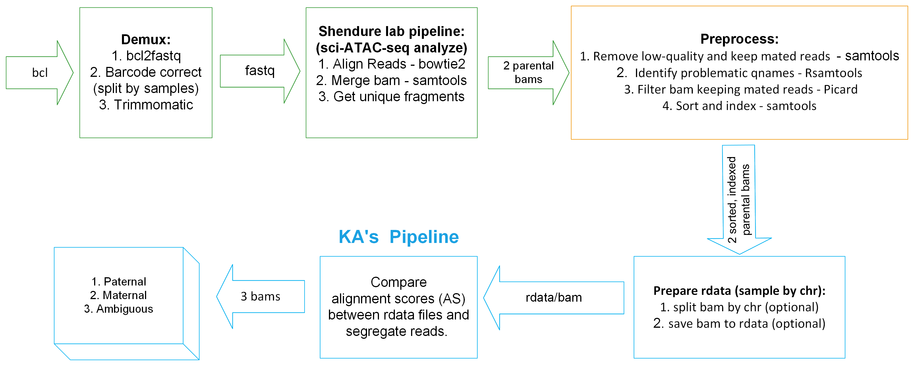

# 2021_kga0_4dn-mouse-cross

### *ALSO* *AL*lele *S*egregati*O*n Pipeline

This ALSO pipeline is used to segregate NGS alignments to alleles of origin based on alignment scores.

## News and Updates

The three most recent updates are shown here; a complete list of updates can be found [here](https://github.com/Noble-Lab/2021_kga0_4dn-mouse-cross/blob/main/log.md).

* 2022-06-15
  - Update `README.md` and `log.md` files
  - `#TODO` Troubleshoot max memory for JVM when running `picard FilterSamReads`
  - `#TODO` Consolidate shell, R functions into one script for each language
  - `#TODO` Remove harcoded path to GS installation of `picard` from scripts `#DONE`

* 2022-06-04
  + Pipeline is completed; passed local unit tests with small files; can call it with `driver_allelic-segregation.sh`
  + Adding instructions for using `driver_allelic-segregation.sh` to `README`.
  + `#TODO` Test on the GS HPC with large files: Do we need to increase max heap memory to the JVM when running `picard`?
  + `#TODO` Clean up messages output by the driver
  + `#TODO` Determine and list all dependencies

* 2022-05-23
  + Addressing error in preprocessing pipeline in which some duplicate QNAMEs persist in processed bam.
  + Adding instructions for using the correction script, `03-remove-duplicate-qnames.sh`.
  + `#TODO` Add corrections in `03-remove-duplicate-qnames.sh` to the initial preprocessing script: `03-filter-problematic-qnames-HPC.sh` `#DONE`

## Installation

  + [argparser](https://bitbucket.org/djhshih/argparser) = 0.7.1
  + [bedtools](https://bedtools.readthedocs.io/en/latest/) >= 2.29.0
  + [parallel](https://www.gnu.org/software/parallel/) >= 20200101
  + [Picard](https://broadinstitute.github.io/picard/) >= 2.26.4
  + [R](https://www.r-project.org/) >= 4.0
  + [Rsamtools](https://bioconductor.org/packages/release/bioc/html/Rsamtools.html) = 2.8.0
  + [samtools](http://www.htslib.org/) >= 1.13
  + [scales](https://scales.r-lib.org/) >= 1.1.1
  + [subread](http://subread.sourceforge.net/) = 2.0.1
  + [Tidyverse](https://www.tidyverse.org/) = 1.3.1

## Workflow



For sci-ATAC-seq experiments part of the 4dn-mouse-cross project, the user needs to run the following steps prior to using the ALSO pipeline:
1. Demux. ([Example Code 1](https://github.com/Noble-Lab/2021_kga0_4dn-mouse-cross/blob/main/bin/workflow/01-demux.sh))
2. sci-ATAC-seq analysis pipeline from the Shendure Lab. ([Example Code 2](https://github.com/Noble-Lab/2021_kga0_4dn-mouse-cross/blob/main/bin/workflow/02-sci-ATAC-seq-analysis.sh))
3. Preprocess the bam. ([Example Code 3](https://github.com/Noble-Lab/2021_kga0_4dn-mouse-cross/blob/main/bin/workflow/03-preprocess-mm10.sh))

Example for calling `driver_allelic-segregation.sh`
```
#  Call from 2021_kga0_4dn-mouse-cross or a directory containing
#+ functions-in-progress.sh, functions-preprocessing-HPC.sh,
#+ get-AS-per-qname.R, find-set-intersection-set-complement.sh,
#+ generate-assignment-lists.R, and filter-qnames-by-assignment.sh
bash ./bin/workflow/driver_allelic-segregation.sh \
-u FALSE \
-l TRUE \
-d TRUE \
-m "512m" \
-x "4096m" \
-r "mm10" \
-s "CAST" \
-1 "path/to/mm10/Disteche_sample_N.dedup.corrected.bam" \
-2 "path/to/CAST/Disteche_sample_N.dedup.corrected.bam" \
-p "Disteche_sample_1_downsampled_test-again" \
-o "./path/to/directory/for/results" \
-b 100000 \
-c 1000000 \
-t 0 \
-a TRUE \
-n 4

# Arguments:
# -h  print this help message and exit
# -u  use safe mode: TRUE or FALSE [logical; default: FALSE]
# -l  run on GS HPC: TRUE or FALSE [logical; default: FALSE]
# -d  run pipeline in ${TMPDIR}: TRUE or FALSE [logical; default:
#     TRUE]
# -m  initial memory allocation pool for JVM [chr; default: "512m"]
# -x  maximum memory allocation pool for JVM [chr; default: "4096m"]
# -r  string for "sample #1" [chr]
# -s  string for "sample #2" [chr]
# -1  bam infile #1, including path [chr]
# -2  bam infile #2, including path [chr]
# -p  prefix for outfiles [chr]
# -o  results directory for outfiles [chr]; path will be made if it
#     does not exist
# -b  number of records to read into memory at one time when running
#     the script for Part #1, get-AS-per-qname.R [int > 0; default:
#     100000]
# -c  number of records to read into memory at one time when running
#     the script for Part #3, generate-assignment-lists.R [int > 0;
#     default: 1000000]
# -t  alignment score threshold [int >= 0; default: 0]; the absolute
#     value of the difference in alignment scores between "sample
#     #1" and "sample #2" must be greater than this value in order
#     for a sample-specific assignment to be made; if not greater than
#     this value, then the assignment will be "ambiguous"
# -a  count lines: TRUE or FALSE [logical; default: TRUE]
# -n  step in pipeline to run up to [int 1-4; default: 4]
```
 
```{bash preprocess-bam}
## 05.11
# run for all 22 samples
chmod 751 *.sh
Date="05-11"
for i in {1..22} ## run 22 samples in parallel
do
    echo "Running: "
    echo $i
    strain="mm10"
    Job_name="mm10_pre"$i
    qsub -l mfree=12G -m bea -M gangliuw@uw.edu -N $Job_name submit.sh $i ${strain} > results/${strain}-preprocessed/2022-${Date}-${strain}-pre-${i}.submit
    echo "Submitted."

    strain="CAST-EiJ"
    Job_name="CAST_pre"$i
    qsub -l mfree=12G -m bea -M gangliuw@uw.edu -N $Job_name submit.sh $i ${strain} > results/${strain}-preprocessed/2022-${Date}-${strain}-pre-${i}.submit
    echo "Submitted."
done

```

Test code for proprocessing (`workflow/03-filter-qname.sh`)
```{bash preprocess-bam-updated}
#  Call from 2021_kga0_4dn-mouse-cross
file="Disteche_sample_1.dedup.bam"
bash ./filter-qnames.sh \
-u FALSE \
-c FALSE \
-l TRUE \
-i ./"${strain}"/get_unique_fragments/"${bam_input}" \
-o "${outpath}" \
-f TRUE \
-r FALSE \
-p 4 \
> "${outpath}"preprocess_${strain}_${sample_id}.o \
2>"${outpath}"preprocess_${strain}_${sample_id}.e

# Arguments:
# -u is for "safe mode" (set -Eeuxo)
# -c is for whether using on the GS HPC or not (T or F)
# -i is for infile
# -o is for outpath
# -p is for number of cores for parallelization (for calls to samtools)
```

Example for calling `03-remove-duplicate-qnames.sh`  `#TODO` Update this...
```
#  Call from 2021_kga0_4dn-mouse-cross or a directory containing
#+ functions-in-progress.sh and functions-preprocessing-HPC.sh
bash ./bin/workflow/03-remove-duplicate-qnames.sh \
-u FALSE \
-c TRUE \
-m "512m" \
-x "4048m" \
-i "${dir_data}/${infile}" \
-o "${dir_data}" \
-n TRUE \
-t FALSE \
-e TRUE \
-r TRUE \
-p "${parallelize}" \
> "${dir_log}/rm-dup-qnames_${strain}_${ID}.o.txt" \
2> "${dir_log}/rm-dup-qnames_${strain}_${ID}.e.txt"

# ./bin/workflow/03-remove-duplicate-qnames.sh:
# Run pipeline to filter duplicate QNAMEs from bam file.
#   - Step 01: Copy files of interest to ${TMPDIR}
#   - Step 02: Sort bam by QNAME
#   - Step 03: List and tally QNAMEs in the sorted bam file
#   - Step 04: Create txt.gz outfiles for QNAME > 2
#   - Step 05: Count lines in infile, outfiles (optional)
#   - Step 06: Tally entries in infile, outfiles (optional)
#   - Step 07: Exclude problematic QNAME reads from bam infile
#   - Step 08: Sort corrected bam by QNAME (optional)
#   - Step 09: List and tally QNAMEs in the corrected bam file
#              (optional)
#   - Step 10: Create txt.gz outfiles for QNAME >, <, = 2 (optional)
#   - Step 11: Remove temporary bams, move ${TMPDIR} outfiles to
#              ${outpath}
#
#
# Dependencies:
#   - parallel >= 20200101
#   - picard >= 2.27.1
#   - samtools >= 1.13
#
#
# Arguments:
# -h print this help message and exit
# -u use safe mode: "TRUE" or "FALSE" (logical)
# -c run on GS HPC: "TRUE" or "FALSE" (logical)
# -m initial memory allocation pool for JVM (chr; default "512m")
# -x maximum memory allocation pool for JVM (chr; default "1g")
# -i bam infile, including path (chr)
# -o path for outfiles (chr); path will be made if it does not exist
# -n count lines: "TRUE" or "FALSE" (logical)
# -t tally entries: "TRUE" or "FALSE" (logical)
# -e evaluate corrected bam: "TRUE" or "FALSE" (logical)
# -r remove intermediate files: "TRUE" or "FALSE" (logical)
# -p number of cores for parallelization (int >= 1; default: 1)
```

This ALSO pipeline takes as input two paired parental bam files (one aligned to a "sample 1" reference genome and the other aligned to a "sample 2" reference genome) that have been sorted and subjected to duplicate removal; ALSO outputs 6 bam files:
  + strain-1 bam comprised of only "strain 1" assignments
  + strain-1 bam comprised of only "strain 2" assignments
  + strain-1 bam comprised of only "ambiguous" assignments
  + strain-2 bam comprised of only "strain 1" assignments
  + strain-2 bam comprised of only "strain 2" assignments
  + strain-2 bam comprised of only "ambiguous" assignments

## Proposed changes to ALSO

1. When setting `-d TRUE`, instead of copying files into and running all steps in `${TMPDIR}`, make it so that only certain programs make use of `${TMPDIR}`, e.g., Picard, Samtools; steps will be run in and files will be written to `-o "./path/to/directory/for/results"`
2. Index bam outfiles while writing them out with Picard: `--CREATE_INDEX <Boolean>`
3. Set Picard FilterSamReads `--MAX_RECORDS_IN_RAM <Integer>`; but seems applicable to only sorting output, which we currently do not do
4. 
