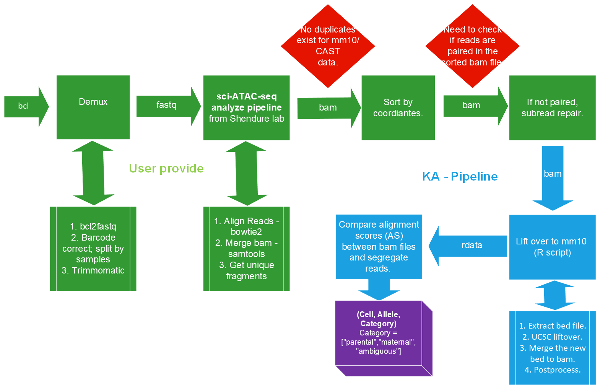

# 2021_kga0_4dn-mouse-cross

### KA Allele Segregation Pipeline

This pipeline is used to perform for allele segregation for sci-ATAC-seq data.

## News and Updates

2022.03.15
* to do list
  + add workflow image.
  + add readme file (describe the flow and example cod to run).
  + create workflow folder.

## Installation

Need to add later.

need to add version number.
R
Liftover
Subread
Samtools

## Workflow



The user would need to run the following steps to prepare the input for KA's pipeline:
1. Demux. ([Example Code](https://github.com/Noble-Lab/2021_kga0_4dn-mouse-cross/blob/main/bin/workflow/01-demux.sh))
2. sci-ATAC-seq analysis pipeline from Shendure lab. ([Example Code](https://github.com/Noble-Lab/2021_kga0_4dn-mouse-cross/blob/main/bin/workflow/02-sci-ATAC-seq-analysis.sh))
3. Sort the bam. (might not need this, Kris is testing.) ([Example Code](https://github.com/Noble-Lab/2021_kga0_4dn-mouse-cross/blob/main/bin/workflow/03-sort.sh))
4. Repair the bam. ([Example Code](https://github.com/Noble-Lab/2021_kga0_4dn-mouse-cross/blob/main/bin/workflow/04-repair.sh))

This pipeline would take as input two bam files (strain 1 assembly and strain 2 assembly) that have been sorted, subject to removal of duplicates, and output a 3-d tensor: (Cell, Allele, Category) where Category can be one of the ["parental","maternal","ambiguous"].

1. liftover to mm10.
2. allele score comparison.

Here, we use mm10/CAST data （might perpare a small bam for testing） as an example:

### 1. liftover to mm10

```{bash liftover}
./liftover.sh input.bam output.rdata?
```

### 2. allele score comparison
```{R liftover}
R CMD 05-AS.R?
```

