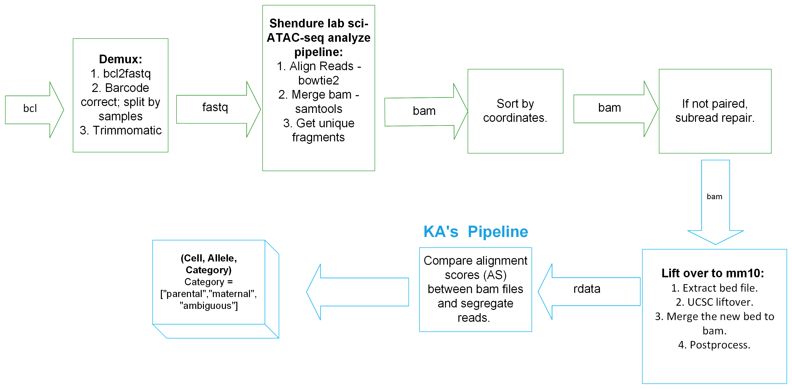

# 2021_kga0_4dn-mouse-cross

### KA Allele Segregation Pipeline

For sci-ATAC-seq data, this pipeline is used to segregate alignments to parental alleles of origin based on alignment scores.

## News and Updates

* 2022-03-19
  + need t update workflow image.
  + update readme for (filter reads with MAPQ < 30; then removing singleton; subread repair).
  + update code for (filter reads with MAPQ < 30; then removing singleton; subread repair.).

* 2022-03-17
  + add new workflow image.
  + CX updated get_unique_fragments.py. Kris will test it on duplicates.
  + After Shendure lab pipeline, we will first filter reads with MAPQ < 30; then removing singleton; (Kris: no need to sort anymore) subread repair. 

* `#TODO` list
  + add workflow image.
  + add `README` file (describe the flow, add example code to run).
  + create workflow folder.

## Installation

`#TODO` Need to add later.

`#TODO` Need to add version numbers.
  + R
  + liftOver
  + subread
  + samtools

## Workflow



The user needs to run the following steps to prepare the input for KA's pipeline:
1. Demux. ([Example Code 1](https://github.com/Noble-Lab/2021_kga0_4dn-mouse-cross/blob/main/bin/workflow/01-demux.sh))
2. sci-ATAC-seq analysis pipeline from Shendure lab. ([Example Code 2](https://github.com/Noble-Lab/2021_kga0_4dn-mouse-cross/blob/main/bin/workflow/02-sci-ATAC-seq-analysis.sh))
3. Preprocess the bam. ([Example Code 3](https://github.com/Noble-Lab/2021_kga0_4dn-mouse-cross/blob/main/bin/workflow/03-preprocess.sh))
    + filter reads with MAPQ < 30; 
    + then remove singleton; 
    + subread repair.
4. Split the bam file by chromosome. Index and "repair" the split bam files. Generate bed files from the split bam files. ([Example Code 4](https://github.com/Noble-Lab/2021_kga0_4dn-mouse-cross/blob/main/bin/workflow/04-split-index-repair-bam.sh))
5. Perform liftOvers of the bed files. (`#TODO Example Code 5`)

This pipeline would take as input two bam files (strain 1 assembly and strain 2 assembly) that have been sorted, subject to removal of duplicates, and output a 3-d tensor: (Cell, Allele, Category) where Category can be one of the ["parental","maternal","ambiguous"].

1. liftover to mm10.
2. allele score comparison.

Here, we use mm10/CAST data （might perpare a small bam for testing） as an example:

### 1. Split bam infile by chromosome; index and "repair" split bam files; generate bed files for liftOver

```{bash split-index-repair-bam}
#  Call script from repo's home directory, 2021_kga0_4dn-mouse-cross

# All chromosomes
bash ./bin/workflow/04-split-index-repair-bam.sh \
-u "FALSE" \
-i "./data/files_bam_test/test.300000.bam" \
-o "./data/04-split-index-repair_test.300000.bam_all" \
-c "all" \
-r "TRUE" \
-b "TRUE" \
-p 4

# Just chromosome X
bash ./bin/workflow/04-split-index-repair-bam.sh \
-u "FALSE" \
-i "./data/files_bam_test/test.300000.bam" \
-o "./data/04-split-index-repair_test.300000.bam_chrX" \
-c "chrX" \
-r "TRUE" \
-b "TRUE" \
-p 4

# Arguments:
# -h <print this help message and exit>
# -u <use safe mode: "TRUE" or "FALSE" (logical)>
# -i <bam infile, including path (chr)>
# -o <path for split bam file(s) (chr); path will be made if it does
#     not exist>
# -c <chromosome(s) to split out (chr); for example, "chr1" for
#     chromosome 1, "chrX" for chromosome X, "all" for all
#     chromosomes>
# -r <use Subread repair on split bam files: "TRUE" or "FALSE"
#     (logical)>
# -b <if "-r TRUE", create bed files from split bam files: "TRUE"
#     or "FALSE" (logical); argument "-b" only needed when "-r
#     TRUE">
# -p <number of cores for parallelization (int >= 1)>

```

### 2. liftOver to mm10
`#TODO #INPROGRESS`

```{bash liftover}
./liftover.sh input.bam output.rdata?
```

### 3. Allele-assignment based on alignment scores
`#TODO #INPROGRESS`

```{R liftover}
R CMD 05-AS.R?
```

