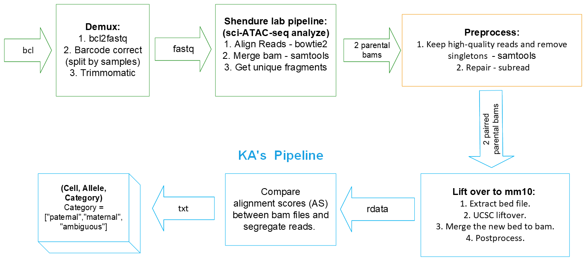

# 2021_kga0_4dn-mouse-cross

### KA Allele Segregation Pipeline

This pipeline is used to segregate sci-ATAC-seq alignments to parental alleles of origin based on alignment scores.

## News and Updates
* 2022-03-20
  + add 05-lift-strain-to-mm10.sh
  + add script to download and process liftOver chain files: get-liftOver-chains.sh
  + add script to downsample bam files: generate-downsampled-bam.sh
  + minor changes to workflow scripts 01 and 04
  + update `README`, including sample-call section

* 2022-03-19
  + update workflow image.
  + update README for (filter reads with MAPQ < 30; then removing singleton; subread repair).
  + update code for (filter reads with MAPQ < 30; then removing singleton; subread repair.).

* 2022-03-17
  + add new workflow image.
  + CX updated get_unique_fragments.py. Kris will test it on duplicates.
  + After Shendure lab pipeline, we will first filter reads with MAPQ < 30; then removing singleton; (Kris: no need to sort anymore) subread repair. 

## Installation

`#TODO` Need to add later.
`#TODO` Need to include additional dependencies.

  + [BBMap](https://sourceforge.net/projects/bbmap/) = 38.95 (untested with other versions)
  + [bedtools](https://bedtools.readthedocs.io/en/latest/) = 2.30.0 (untested with other versions)
  + [liftOver](http://hgdownload.soe.ucsc.edu/downloads.html#source_downloads) >= 366 
  + [parallel](https://www.gnu.org/software/parallel/) >= 20200101
  + [R](https://www.r-project.org/) >= 4.0 
  + [Rsamtools](https://bioconductor.org/packages/release/bioc/html/Rsamtools.html) = 2.8.0 (untested with other versions)
  + [samtools](http://www.htslib.org/) >= 1.13 
  + [subread](http://subread.sourceforge.net/) = 2.0.1 (untested with other versions)
  + [Tidyverse](https://www.tidyverse.org/) = 1.3.1 (untested with other versions)

## Workflow



The user needs to run the following steps to prepare the input for KA's pipeline:
1. Demux. ([Example Code 1](https://github.com/Noble-Lab/2021_kga0_4dn-mouse-cross/blob/main/bin/workflow/01-demux.sh))
2. sci-ATAC-seq analysis pipeline from the Shendure Lab. ([Example Code 2](https://github.com/Noble-Lab/2021_kga0_4dn-mouse-cross/blob/main/bin/workflow/02-sci-ATAC-seq-analysis.sh))
3. Preprocess the bam. ([Example Code 3](https://github.com/Noble-Lab/2021_kga0_4dn-mouse-cross/blob/main/bin/workflow/03-preprocess.sh))
   + filter reads with MAPQ < 30,
   + remove singletons,
   + then perform subread repair.

This pipeline takes as input two bam files (strain 1 assembly and strain 2 assembly) that have been sorted, subject to duplicate removal, and outputs a 3D tensor: (Cell, Allele, Category), where Category can be one of the ["paternal","maternal","ambiguous"].

1. liftOver to mm10.
  a. Split the bam file by chromosome. Index and "repair" the split bam files. Generate bed files from the split bam files. ([Example Code](https://github.com/Noble-Lab/2021_kga0_4dn-mouse-cross/blob/main/bin/workflow/04-split-index-repair-bam.sh))
  b. Perform liftOvers of the bed files. ([Example Code](https://github.com/Noble-Lab/2021_kga0_4dn-mouse-cross/blob/main/bin/workflow/05-lift-strain-to-mm10.sh))
2. Allele score comparison.
`#TODO` Need to add example code.

Here, we use the downsampled mm10/CAST data as an example:

### 1. Split bam infile by chromosome; index and "repair" split bam files; and then generate bed files for needed for liftOver

```{bash split-index-repair-bam}
#  Call script from the repo's home directory, 2021_kga0_4dn-mouse-cross
safe_mode="FALSE"
infile="./data/files_bam_test/test.300000.bam"
outpath="./data/2022-0320_test_04-05_all"
chromosome="all"
repair="TRUE"
bed="TRUE"
parallelize=4

bash bin/workflow/04-split-index-repair-bam.sh \
-u "${safe_mode}" \
-i "${infile}" \
-o "${outpath}" \
-c "${chromosome}" \
-r "${repair}" \
-b "${bed}" \
-p "${parallelize}"

#  Run time: 11 seconds

# -h <print this help message and exit>
# -u <use safe mode: "TRUE" or "FALSE" (logical)>
# -i <bam infile, including path (chr)>
# -o <path for split bam file(s) and bed files (chr); path will be
#     made if it does not exist>
# -c <chromosome(s) to split out (chr); for example, "chr1" for
#     chromosome 1, "chrX" for chromosome X, "all" for all
#     chromosomes>
# -r <use Subread repair on split bam files: "TRUE" or "FALSE"
#     (logical)>
# -b <if "-r TRUE", create bed files from split bam files: "TRUE"
#     or "FALSE" (logical); argument "-b" only needed when "-r
#     TRUE">
# -p <number of cores for parallelization (int >= 1)>
```

### 2. Lift coordinates over from the initial alignment-strain coordinates (e.g., "CAST-EiJ" coordinates) to "mm10" coordinates

```{bash lift-strain-to-mm10}
#  Call script from the repo's home directory, 2021_kga0_4dn-mouse-cross
#  (Requirement: GNU Parallel should be in your "${PATH}"; install it if not)
safe_mode="FALSE"
infile="$(find "./data/2022-0320_test_04-05_all" -name "*.*os.bed" | sort -n)"
outpath="./data/2022-0320_test_04-05_all"
strain="CAST-EiJ"
chain="./data/files_chain/CAST-EiJ-to-mm10.over.chain.gz"

#  Run with four threads
parallel --header : -k -j 4 \
"bash ./bin/workflow/05-lift-strain-to-mm10.sh \
-u {safe_mode} \
-i {infile} \
-o {outpath} \
-s {strain} \
-c {chain}" \
::: safe_mode "${safe_mode}" \
::: infile "${infile[@]}" \
::: outpath "${outpath}" \
::: strain "${strain}" \
::: chain "${chain}"

#  Run time: 119 seconds

# -h <print this help message and exit>
# -u <use safe mode: "TRUE" or "FALSE" (logical)>
# -i <bed infile, including path (chr)>
# -o <path for "lifted" bed outfiles (chr)>
# -s <strain for performing liftOver of bed files; currently available
#     options:
#     - "CAST-EiJ", "CAST", or "C" for "CAST-EiJ"
#     - "129S1-SvImJ", "129", or "1" for "129S1-SvImJ"
#     - "CAROLI-EiJ", "CAROLI", "Ryukyu" or "R" for "CAROLI-EiJ"
#     - "SPRET-EiJ", "SPRET", or "S" for "SPRET-EiJ>"
# -c <gzipped liftOver chain file for strain, including path (chr);
#     note: for liftOver to work, the liftOver strain chain should
#     match the strain set in argument "-s">

#  Additional details for GNU Parallel
#+ - gnu.org/software/parallel/
#+ - can install via, for example, Homebrew, Conda, or MacPorts
#+   - $ brew install parallel
#+   - $ conda install -c conda-forge parallel
#+   - $ sudo port install parallel
#+ - available on the UW GS HPC: $ module load parallel/20200922
```

### 3. Allele-assignment based on alignment scores
`#TODO #INPROGRESS`

```{R liftover}
R CMD 05-AS.R?
```
