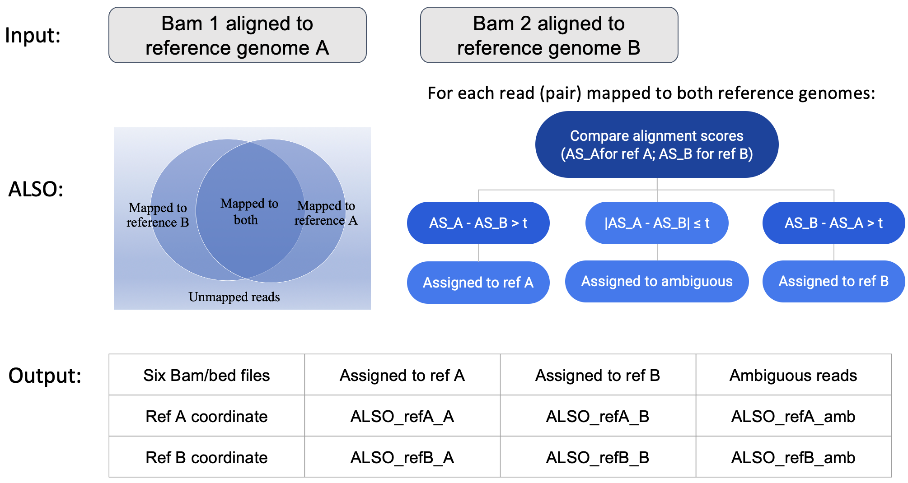

Welcome to ALSO's documentation!
===================================

**ALSO** *AL*lele *S*egregati*O*n Pipeline

Composed of a small set of Python, Shell, and R scripts, the ALSO pipeline segregates NGS alignments to alleles of origin based on alignment scores.

Check out the :doc:`usage` section for further information, including
how to :ref:`installation` the project.

.. note::

   This project is under active development.

*ALSO* is maintained by Kris Alavattam [kalavattam@gmail.com] and Gang Li [gangliuw@uw.edu].

*News and Updates*
All notable changes to this project will be documented in [this file](https://github.com/GangLiTarheel/DeepGWAS/blob/main/changelog.md).
  

*Citation*
1. ALSO ms.

*Proposed changes to ALSO* 
1. readthedoc format.

Contents
--------

.. toctree::

   usage
   api
